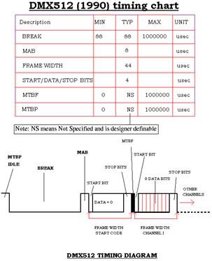
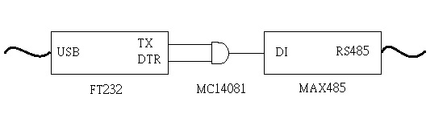
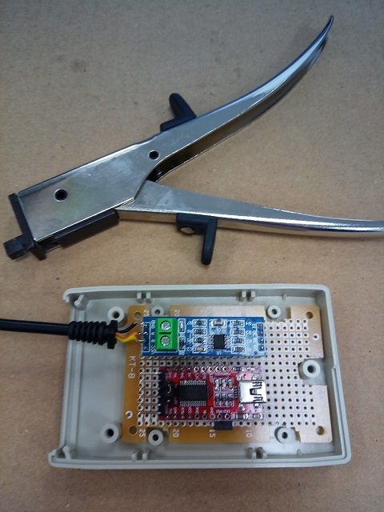
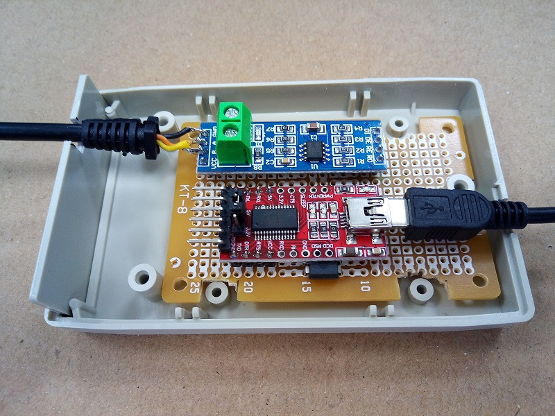
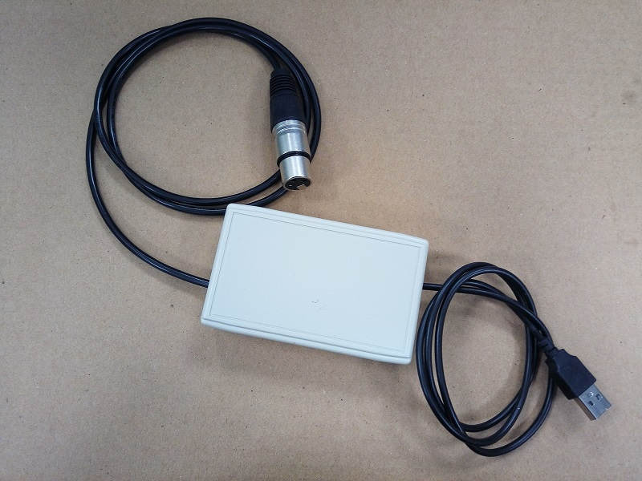
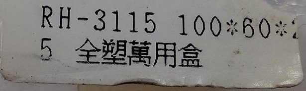
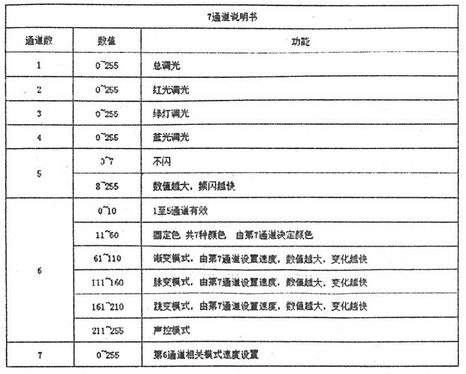
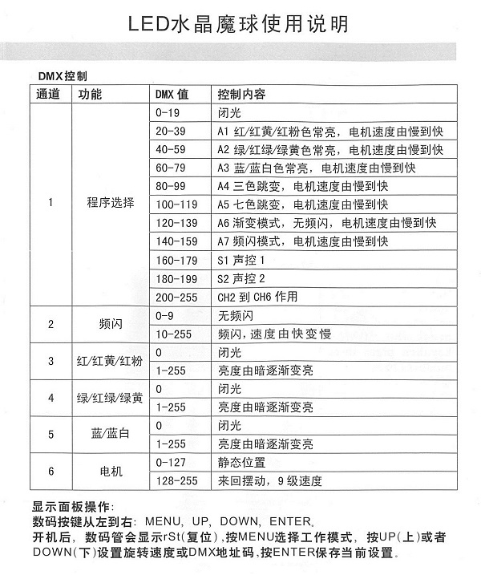

# dmx512_ft232
Using FTDI ft232 as host controller to control DMX512 device in Ubuntu 
# In progress
## Discription
DMX512 protocol includes a status of break. 
In order to make status of break, I use DTR to carry out it. 
 
 
 
 
 
  
 
  
 
  
 
  
 
# Test sample code
## Test par light
 
Datasheet of channel  

  
 
Make sure /dev/ttyUSB0 is a+rw 
Make sure address of par light is 001. 
### Test red light. 
./a.out 255 255 0 0 0 0 0 0 0 0  

### Test green light. 
./a.out 255 0 255 0 0 0 0 0 0 0  

### Test blue light. 
./a.out 255 0 0 255 0 0 0 0 0 0  

## Test magic ball light
 

  
Make sure /dev/ttyUSB0 is a+rw 
Make sure address of par light is 001. 
### Test red light. 
./a.out 39 0 0 0 0 0 0 0 0 0  

### Test green light. 
./a.out 59 0 0 0 0 0 0 0 0 0  

### Test blue light. 
./a.out 79 0 0 0 0 0 0 0 0 0  
