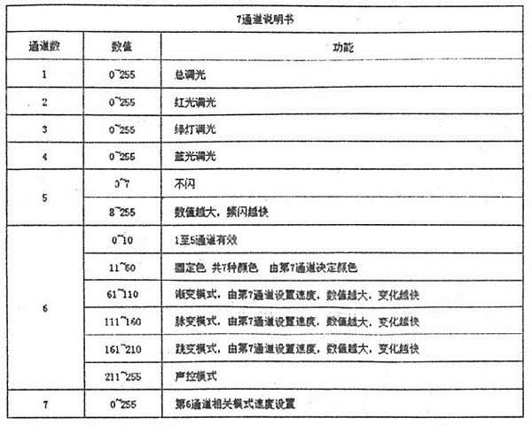

# dmx512_ft232
Using FTDI ft232 as host controller to control DMX512 device in Ubuntu 
# In progress
## Discription
DMX512 protocol includes a status of break. 
In order to make status of break, I use DTR to carry out it. 
 
 
 
 
 
  
 
  
 
  
 
# Test sample code
## Test par light
 
Datasheet of channel 
 
 
  
 
Make sure /dev/ttyUSB0 is a+rw 
Make sure address of par light is 001. 
Test red light. 
Test green light. 
Test blue light. 
Test off light. 

## Test magic ball light
Make sure /dev/ttyUSB0 is a+rw 
Make sure address of par light is 001. 
